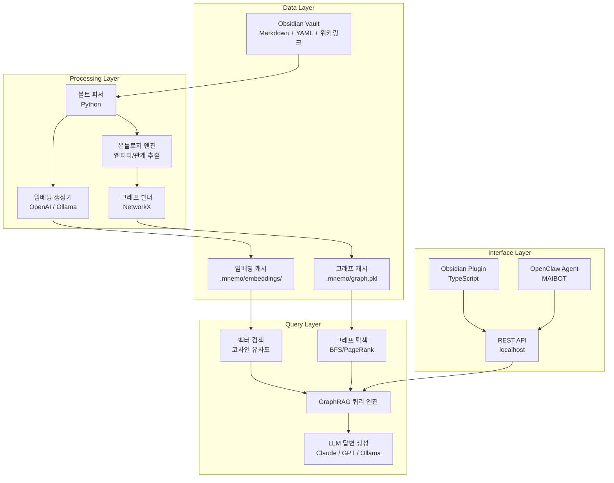

# D001-아키텍처 설계: Mnemo 시스템 아키텍처

**버전:** 1.0  
**작성일:** 2026-02-20  

---

## 1. 시스템 구성도



---

## 2. 컴포넌트 상세

### 2.1 볼트 파서 (Vault Parser)

**역할:** Obsidian 볼트의 마크다운 파일을 구조화된 데이터로 변환

**입력:** `*.md` 파일  
**출력:** `NoteDocument` 객체

```python
@dataclass
class NoteDocument:
    path: str
    name: str
    content: str
    frontmatter: dict          # YAML 메타데이터
    wiki_links: list[str]      # [[링크]] 목록
    tags: list[str]            # #태그 목록
    headings: list[str]        # 제목 계층
    entity_type: str           # 온톨로지 분류
    checksum: str              # 변경 감지용 해시
```

**증분 처리:**
```python
def incremental_parse(vault_path, cache_path):
    cached_checksums = load_cache(cache_path)
    changed_files = []
    
    for md_file in vault_path.rglob("*.md"):
        current_hash = hash_file(md_file)
        if current_hash != cached_checksums.get(md_file.name):
            changed_files.append(md_file)
    
    # 변경된 파일만 파싱
    return [parse_note(f) for f in changed_files]
```

### 2.2 온톨로지 엔진 (Ontology Engine)

**역할:** 노트를 엔티티로 분류하고, 관계를 추출

**분류 전략 (우선순위):**
1. YAML `type:` 필드가 있으면 직접 사용
2. 태그 기반 추론 (`#person`, `#concept`, `#project` 등)
3. LLM 기반 자동 분류 (fallback)

```python
ENTITY_MAP = {
    "person": ["#person", "#people", "#team"],
    "concept": ["#concept", "#idea", "#theory"],
    "project": ["#project", "#mai"],
    "tool": ["#tool", "#software", "#framework"],
    "insight": ["#insight", "#lesson", "#takeaway"],
    "source": ["#book", "#video", "#article", "#paper"],
    "event": ["#meeting", "#event", "#conference"],
    "decision": ["#decision", "#policy"],
}
```

### 2.3 그래프 빌더 (Graph Builder)

**역할:** NoteDocument 목록 → NetworkX DiGraph

**엣지 타입:**
| 타입 | 소스 | 예시 |
|------|------|------|
| `wiki_link` | `[[위키링크]]` | 본문에서 다른 노트 참조 |
| `explicit_relation` | YAML `related:` | 명시적 관계 선언 |
| `tag_cooccurrence` | 동일 태그 공유 | 같은 `#ai` 태그를 가진 노트 간 |
| `source_reference` | YAML `source:` | 출처 추적 |
| `derived_from` | YAML `derived_from:` | 파생 관계 |

### 2.4 GraphRAG 쿼리 엔진

**역할:** 자연어 질문 → 그래프 탐색 + 벡터 검색 → LLM 답변

**쿼리 파이프라인:**

```
사용자 질문
    │
    ▼
┌─────────────┐
│ 질문 분석    │ → 키워드/엔티티 추출
└──────┬──────┘
       │
   ┌───┴───┐
   ▼       ▼
┌──────┐ ┌──────┐
│벡터  │ │그래프│
│검색  │ │탐색  │
│Top-K │ │N-hop │
└──┬───┘ └──┬───┘
   │        │
   └───┬────┘
       ▼
┌─────────────┐
│ 결과 병합    │ → 가중 점수 (α·벡터 + β·그래프)
│ + 재순위화   │
└──────┬──────┘
       ▼
┌─────────────┐
│ 컨텍스트    │ → 노트 내용 + 관계 정보 조합
│ 구성        │
└──────┬──────┘
       ▼
┌─────────────┐
│ LLM 답변    │ → 소스 노트 인용 포함
│ 생성        │
└─────────────┘
```

**가중 파라미터:**
- `α` (벡터 가중치): 0.6 (기본)
- `β` (그래프 가중치): 0.4 (기본)
- 사용자 조정 가능

---

## 3. 데이터 흐름도

### 3.1 지식 수집 흐름

```
RSS Feed / 웹페이지 / YouTube
    │
    ▼ (OpenClaw 크론)
수집기 (Python)
    │ → 본문 추출, AI 요약, 메타데이터 생성
    ▼
Obsidian 볼트에 .md 파일 생성
    │ → YAML frontmatter 자동 포함
    ▼
파일 변경 감지 (watchdog / 크론)
    │
    ▼
그래프 증분 업데이트 + 임베딩 생성
```

### 3.2 질의 응답 흐름

```
사용자 질문 (Obsidian 플러그인 / Discord / OpenClaw)
    │
    ▼
REST API (localhost:7890)
    │
    ▼
GraphRAG 쿼리 엔진
    │ → 벡터검색 + 그래프탐색 + LLM
    ▼
답변 + 소스 노트 목록
    │
    ▼
UI 렌더링 (플러그인) 또는 메시지 전송 (OpenClaw)
```

---

## 4. API 설계

### 4.1 REST API (localhost)

```
POST /api/query
  Body: { "question": "GraphRAG와 관련된 프로젝트는?", "top_k": 5 }
  Response: { "answer": "...", "sources": [...], "graph_context": {...} }

POST /api/build
  Body: { "incremental": true }
  Response: { "nodes": 1234, "edges": 5678, "updated": 42 }

GET /api/graph/stats
  Response: { "nodes": 1234, "edges": 5678, "top_entities": [...] }

GET /api/graph/neighbors/{node_name}
  Query: ?hops=2
  Response: { "neighbors": [...], "edges": [...] }

POST /api/suggest
  Body: { "note_name": "새 노트 제목", "content": "..." }
  Response: { "related_notes": [...], "suggested_tags": [...] }
```

### 4.2 Obsidian 플러그인 ↔ Python 서버 통신

```
플러그인 → HTTP → Python 서버 (localhost:7890)
                      │
                      ├── NetworkX 그래프 (메모리)
                      ├── 임베딩 캐시 (디스크)
                      └── LLM 클라이언트
```

---

## 5. 디렉토리 구조

```
.\
├── docs/                    # 프로젝트 문서
├── src/
│   ├── core/
│   │   ├── parser.py        # 볼트 파서
│   │   ├── ontology.py      # 온톨로지 엔진
│   │   ├── graph_builder.py # 그래프 빌더
│   │   ├── embedder.py      # 임베딩 생성기
│   │   └── graphrag.py      # GraphRAG 쿼리 엔진
│   ├── collectors/
│   │   ├── rss.py           # RSS 수집기
│   │   ├── youtube.py       # YouTube 요약
│   │   └── web_clipper.py   # 웹 클리핑
│   ├── agents/
│   │   ├── review.py        # 망각 곡선 복습
│   │   └── briefing.py      # 오디오 브리핑
│   ├── api/
│   │   └── server.py        # FastAPI 서버
│   └── plugin/              # Obsidian 플러그인 (TypeScript)
│       ├── main.ts
│       ├── manifest.json
│       └── src/
├── .mnemo/                  # 캐시 디렉토리
│   ├── embeddings/          # 벡터 임베딩 캐시
│   ├── graph.pkl            # 그래프 캐시
│   └── checksums.json       # 파일 해시 캐시
├── tests/
├── requirements.txt
├── pyproject.toml
└── README.md
```

---

## 6. 배포/운영 아키텍처

### 6.1 로컬 우선 (기본)

```
사용자 PC
├── Obsidian (볼트 편집)
├── Mnemo Python 서버 (localhost:7890)
│   └── NetworkX + 임베딩 + LLM 클라이언트
├── Mnemo Obsidian 플러그인 (UI)
└── OpenClaw Gateway (자동화/크론)
```

모든 데이터가 로컬에 머무름. 인터넷은 LLM API 호출에만 사용 (Ollama 쓰면 완전 오프라인도 가능).

### 6.2 클라우드 옵션 (향후)

```
사용자 PC                          Cloud
├── Obsidian ──── Sync ────→ Mnemo Cloud
├── Plugin  ──── API ─────→ GraphRAG 서버
└── OpenClaw ─────────────→ Agent 서버
```

---

## 7. 보안 고려사항

| 항목 | 설계 |
|------|------|
| **데이터 저장** | 100% 로컬 (볼트 디렉토리) |
| **API 키** | `.env` 파일, git 무시 |
| **서버 바인딩** | localhost만 (외부 접근 차단) |
| **임베딩 캐시** | `.mnemo/` 디렉토리, git 무시 |
| **LLM 전송** | 질의 컨텍스트만 전송 (전체 볼트 아님) |
| **로컬 LLM** | Ollama 옵션으로 완전 오프라인 가능 |

---

*Created: 2026-02-20 by MAIBOT*
